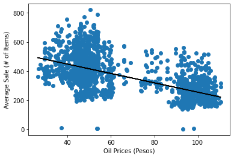
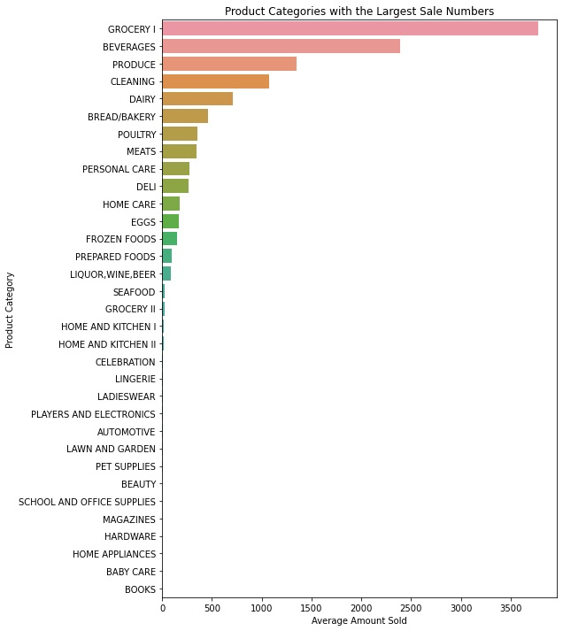
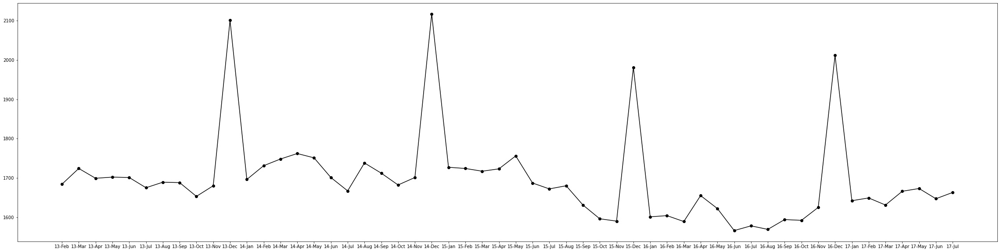

# Ecuadorian Grocery Sales

  
Favorita is one of the largest grocery chains in Ecuador. Taking their time series data, I explored the data to gain insights on how products are purchased, and how external factors like oil prices and holidays effect sales. Visualization is important in data analysis as it is easily shows non-technical viewers trends in the data.

Ecuador is an oil-dependent country and it's economical health is highly vulnerable to shocks in oil prices. Shipping products to grocery stores all over Ecuador effects the inventory and therefore sales. With a negative trend seen in the scatter plot below, we can see that the higher the oil prices, the lower the average sale numbers are.  

You can see that groceries, beverages, and produce are the top 3 product categories sold in Ecuador. We can predict that these categories would have a much greater weight or affect in our time series analysis rather than categories like baby care and books.  

Here is a graph that represents the average number of transactions across all 54 locations. This visually represents the spending tendencies Ecuador, where an increase of about 300-400 more transactions are made during December. This is consistant with the increase in holidays seen in the previous graph.  

